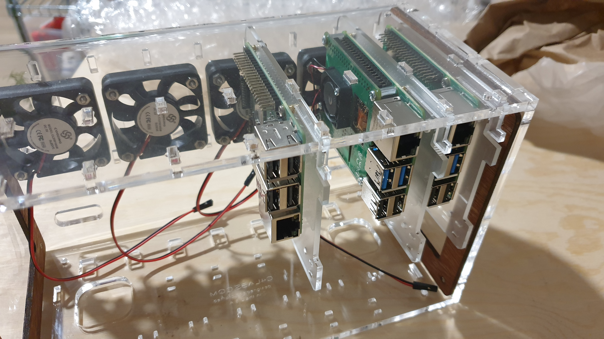

# K8S cluster on Raspberry Pi

This project allows everyone to easily build a Kubernetes cluster using [Raspberry Pi](https://www.raspberrypi.com/)
and [Rancher's k3s](https://docs.k3s.io/).

I initially created it for my own personal use, to experiment with [cloudnative-pg](https://cloudnative-pg.io/),
[longhorn](https://longhorn.io/), and to run my own cloud services using [nextcloud](https://nextcloud.com/). Now I'd like to share the
knowledge I gained and the collection of bash scripts with anyone is interested in
learning, practicing, and improving this project.

## Minimum Requirements

### Hardware

* x3 RPi 8GB RAM (I used v4)
* x3 SD cards
* x3 SSD disks
* x3 SATA to USB-3
* x1 network switch (4 ports)

Power adapters/cables, and network cables are omitted, but required.

### Distribution

* [Debian for RPi](https://raspi.debian.net/tested-images/)

## Procedure

Follow the procedure in the `docs/` directory:

1. [Update RPi4 Firmware (when necessary)](docs/01-update-firmware.md)
2. [Install Debian for RPi](docs/02-install-debian.md)
3. [Clone image on SSD and mount it as `root`](docs/03-clone-image-on-ssd.md)
4. [Prepare RPi nodes installing and configuring packages](docs/04-preparing-nodes.md)
5. [Setup cluster installing k3s on each node](docs/05-setup-k8s.md)

## Scripts

* `install-sd.sh` - writes distro image to SD card, adds SSH key, configures hostname, downloads `rpi-clone` repo inside `/root`
* `install-kluster.sh` - install k3s and deploy required resources on the cluster following the correct procedure
* `init-k3s-master.sh` - install and deploy the first k3s master
* `join-k3s-master.sh` - install and deploy a new k3s master to join the cluster
* `join-k3s-agent.sh` - install and deploy a new k3s agent to join the cluster
* `deploy-resources.sh` - install the specified resources in the `resources.list` file

## Sources

### Raspberry Pi

* [Update Raspberry Firmware #1](https://lemariva.com/blog/2020/12/raspberry-pi-4-ssd-booting-enabled-trim)
* [Raspberry Firmware Release Notes](https://github.com/raspberrypi/rpi-eeprom)
* [Boot from USB](https://www.raspberrypi.com/documentation/computers/raspberry-pi.html#usb-mass-storage-boot)
* [Debian for RPi](https://raspi.debian.net/defaults-and-settings/)
* [Image clone guide](https://notenoughtech.com/raspberry-pi/how-to-boot-raspberry-pi-4-from-usb/)
* [RPi Clone tool](https://github.com/billw2/rpi-clone)
* [RPi Boot from SSD](https://jamesachambers.com/new-raspberry-pi-4-bootloader-usb-network-boot-guide/)
* [Raspberry Pi cheat sheet](https://github.com/LukaszLapaj/raspberry-pi-cheat-sheet)

### Kubernetes

* [K8S on RPi video](https://www.youtube.com/watch?v=B2wAJ5FLOYw)
* [K8S on RPi](https://uthark.github.io/post/2020-09-02-installing-kubernetes-raspberrypi/)
* [K3S multimaster HA](https://rancher.com/docs/k3s/latest/en/installation/ha-embedded/)

### Network

* [Calico installation](https://docs.projectcalico.org/getting-started/kubernetes/k3s/multi-node-install)

### Load Balancer

* [MetalLB on GH](https://github.com/metallb/metallb)

### Storage

* [Longhorn on GH](https://github.com/longhorn/longhorn)

### Ingress

* [Nginx Ingress on GH](https://github.com/kubernetes/ingress-nginx)

### Database

* [Cloudnative-pg on GH](https://github.com/cloudnative-pg/cloudnative-pg)

